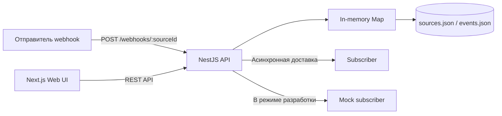
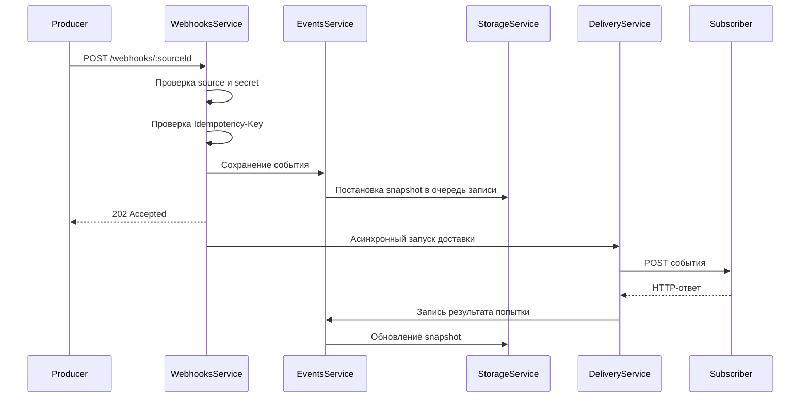
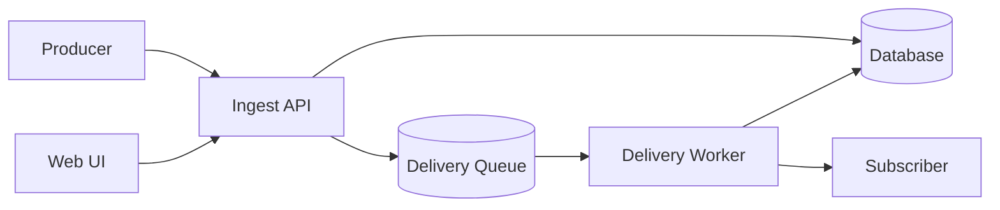

> **О трактовке ретраев.** В ТЗ (раздел 3) указано «до 3 попыток при неуспехе... задержки 1 с, 3 с, 9 с между попытками». Между тремя попытками — ровно два промежутка, поэтому серия доставки использует первые два значения из списка: 1 секунда после первой неудачной попытки и 3 секунды после второй. Третье значение (9 с) описывало бы промежуток перед четвёртой попыткой, которой в серии из трёх нет, и поэтому в реализации не используется.

## Быстрый старт

### Требования

Для запуска необходимы:

- Node.js;
- npm;
- свободные порты `3000`, `4002` и `5001`.

### Установка

Установите зависимости из корня проекта:

```bash
npm ci
```

### Настройка окружения

Скопируйте пример переменных окружения:

```bash
cp .env.example .env
```

Текущее содержимое `.env.example`:

```dotenv
API_PORT=4002
SUBSCRIBER_URL=http://localhost:5001/deliver
NEXT_PUBLIC_API_URL=http://localhost:4002
DATA_DIR=data/events.json
```

### Запуск

Запустите API, Web UI и mock subscriber одной командой:

```bash
npm run dev
```

Корневой скрипт запускает параллельно:

- NestJS API;
- Next.js Web UI;
- mock subscriber из `scripts/mock-subscriber.mjs`.

После запуска доступны:

| Компонент | Адрес |
| --- | --- |
| Web UI | http://localhost:3000 |
| API | http://localhost:4002 |
| Mock subscriber | http://localhost:5001/deliver |

Компоненты также можно запускать отдельно:

```bash
npm run dev:api
```

```bash
npm run dev:web
```

```bash
npm run mock
```

## Архитектура

Проект организован как npm-монорепозиторий и состоит из трёх запускаемых компонентов:

- **API** — NestJS 11 с Fastify;
- **Web UI** — Next.js 16 и React 19;
- **Mock subscriber** — тестовый HTTP-сервер на Node.js.



### API

API разделён на функциональные NestJS-модули:

| Модуль | Ответственность |
| --- | --- |
| `SourcesModule` | Создание и чтение источников webhook |
| `WebhooksModule` | Приём входящих webhook, проверка secret и идемпотентности |
| `EventsModule` | Хранение, фильтрация и получение событий |
| `DeliveryModule` | Доставка событий подписчику и повторные попытки |
| `StorageModule` | Персистентность источников и событий в JSON-файлах |

Дополнительно API предоставляет:

- `GET /health` для проверки доступности;
- Swagger UI по адресу `/docs`;
- глобальную валидацию входных DTO;
- единый формат ошибок;
- CORS для запросов из Web UI.

### Обработка входящего webhook

Последовательность обработки выглядит следующим образом:

1. Отправитель вызывает `POST /webhooks/:sourceId`.
2. API проверяет существование источника.
3. Если у источника задан `secret`, значение заголовка `X-Webhook-Secret` проверяется с помощью timing-safe сравнения.
4. При наличии `Idempotency-Key` API проверяет, не было ли событие уже принято для этого источника.
5. Событие получает UUID и сохраняется со статусом `pending`.
6. Клиенту возвращается `202 Accepted`.
7. Доставка подписчику запускается асинхронно и не блокирует ответ отправителю.



Идемпотентность имеет область действия одного источника: ключ формируется из `sourceId` и `Idempotency-Key`. Таблица идемпотентности хранится только в памяти процесса и после перезапуска API не восстанавливается.

### Доставка событий

URL подписчика определяется в следующем порядке:

1. `subscriberUrl`, заданный непосредственно у источника;
2. глобальная переменная окружения `SUBSCRIBER_URL`.

Подписчику отправляется JSON следующей структуры:

```json
{
  "eventId": "uuid",
  "sourceId": "uuid",
  "payload": {},
  "receivedAt": "2026-07-27T15:42:51.463Z"
}
```

Если у источника задан `secret`, API подписывает сериализованное тело с помощью HMAC-SHA256 и добавляет заголовок:

```text
X-Signature: sha256=<hex-digest>
```

Для каждой серии доставки выполняется не более трёх попыток:

1. первая — сразу;
2. вторая — через 1 секунду;
3. третья — ещё через 3 секунды.

Тайм-аут одной попытки составляет 5 секунд. Любой HTTP-ответ с кодом `2xx` считается успешной доставкой. HTTP-ошибки, сетевые ошибки и тайм-ауты сохраняются в истории события.

Событие может иметь один из статусов:

- `pending` — доставка выполняется или ожидает следующей попытки;
- `delivered` — подписчик успешно принял событие;
- `failed` — все три попытки завершились ошибкой.

Ручной вызов `POST /api/events/:id/retry` запускает новую серию доставки. История предыдущих попыток при этом сохраняется.

### Хранение данных

Актуальное состояние работающего API хранится в двух коллекциях `Map`:

- источники;
- события.

После каждого изменения создаётся полный snapshot соответствующей коллекции и ставится в последовательную очередь записи. Данные сохраняются в файлы:

```text
<DATA_DIR>/sources.json
<DATA_DIR>/events.json
```

Запись выполняется через временный файл с последующим атомарным переименованием. Последовательная очередь предотвращает перезапись нового состояния более старой, но медленно завершившейся операцией.

При запуске API данные загружаются из JSON-файлов обратно в память. При корректном завершении процесса приложение дожидается окончания всех поставленных в очередь записей.

> `DATA_DIR` должен содержать путь к каталогу, а не к отдельному JSON-файлу.

### Web UI

Web UI построен на Next.js App Router и обращается к API по адресу из `NEXT_PUBLIC_API_URL`.

Интерфейс содержит две основные страницы:

- `/` — список событий с фильтрацией по источнику и статусу, а также пагинацией;
- `/events/:id` — тело события, сохранённые заголовки, статус и история доставки.

Основные запросы списка и деталей выполняются серверными компонентами Next.js без кеширования. Кнопка повторной доставки является клиентским компонентом и вызывает API непосредственно из браузера.

### Работа с чувствительными данными

Для входящих webhook сохраняются только заголовки из whitelist:

- `content-type`;
- `user-agent`;
- `x-webhook-secret`.

Значение `x-webhook-secret` заменяется на `***`. Secret источника хранится во внутренней модели, но никогда не возвращается через публичный API — вместо него клиент получает только признак `hasSecret`.

## API

По умолчанию API доступен по адресу `http://localhost:4002`, а интерактивная Swagger-документация — по адресу:

```text
http://localhost:4002/docs
```

Все ответы с телом возвращаются в формате JSON.

### Проверка доступности

```http
GET /health
```

Пример ответа:

```json
{
  "status": "ok"
}
```

### Источники

Источник определяет точку приёма webhook, опциональный secret и адрес подписчика.

#### Создать источник

```http
POST /api/sources
Content-Type: application/json
```

Тело запроса:

```json
{
  "name": "payments",
  "secret": "s3cret",
  "subscriberUrl": "http://localhost:5001/deliver"
}
```

Поля:

| Поле | Обязательное | Описание |
| --- | --- | --- |
| `name` | Да | Имя источника длиной от 1 до 64 символов |
| `secret` | Нет | Secret для проверки входящих webhook и подписи исходящих запросов |
| `subscriberUrl` | Нет | URL подписчика; по умолчанию используется `SUBSCRIBER_URL` |

Пример запроса:

```bash
curl -X POST http://localhost:4002/api/sources \
  -H 'Content-Type: application/json' \
  -d '{
    "name": "payments",
    "secret": "s3cret",
    "subscriberUrl": "http://localhost:5001/deliver"
  }'
```

Ответ `201 Created`:

```json
{
  "id": "3f2a8c1e-5b0d-4f7a-9c3e-1d2b4a5c6e7f",
  "name": "payments",
  "ingestUrl": "http://localhost:4002/webhooks/3f2a8c1e-5b0d-4f7a-9c3e-1d2b4a5c6e7f",
  "hasSecret": true,
  "subscriberUrl": "http://localhost:5001/deliver",
  "createdAt": "2026-07-27T14:00:00.000Z"
}
```

Значение `secret` никогда не возвращается API.

#### Получить список источников

```http
GET /api/sources
```

```bash
curl http://localhost:4002/api/sources
```

Ответ `200 OK` содержит массив источников.

#### Получить источник

```http
GET /api/sources/:id
```

```bash
curl http://localhost:4002/api/sources/3f2a8c1e-5b0d-4f7a-9c3e-1d2b4a5c6e7f
```

Возможные ответы:

- `200 OK` — источник найден;
- `400 Bad Request` — идентификатор не является UUID;
- `404 Not Found` — источник не найден.

### Приём webhook

```http
POST /webhooks/:sourceId
Content-Type: application/json
X-Webhook-Secret: <secret>
Idempotency-Key: <key>
```

Тело может содержать произвольный JSON-объект или массив.

```bash
curl -X POST \
  http://localhost:4002/webhooks/3f2a8c1e-5b0d-4f7a-9c3e-1d2b4a5c6e7f \
  -H 'Content-Type: application/json' \
  -H 'X-Webhook-Secret: s3cret' \
  -H 'Idempotency-Key: payment-123' \
  -d '{
    "type": "payment.succeeded",
    "paymentId": "pay_123",
    "amount": 1500
  }'
```

Ответ `202 Accepted`:

```json
{
  "eventId": "96ddc69e-fbf5-45d5-bef4-a42f87a4f194",
  "status": "received"
}
```

Заголовки:

| Заголовок | Обязательный | Описание |
| --- | --- | --- |
| `Content-Type` | Для JSON | Тип содержимого запроса |
| `X-Webhook-Secret` | Если у источника задан secret | Подтверждает право отправки webhook |
| `Idempotency-Key` | Нет | Предотвращает повторное создание события в рамках одного источника |

Повторный запрос с одинаковыми `sourceId` и `Idempotency-Key` вернёт ранее созданный `eventId`. Идемпотентность хранится в памяти и сбрасывается после перезапуска API.

После приёма события доставка подписчику запускается асинхронно. Ответ `202` подтверждает приём события, но не успешную доставку.

Возможные ошибки:

- `401 Unauthorized` — передан неверный или отсутствующий secret;
- `404 Not Found` — источник не найден.

### События

#### Получить список событий

```http
GET /api/events
```

Поддерживаемые query-параметры:

| Параметр | По умолчанию | Описание |
| --- | --- | --- |
| `sourceId` | — | Фильтр по UUID источника |
| `status` | — | `received`, `pending`, `delivered` или `failed` |
| `page` | `1` | Номер страницы, начиная с 1 |
| `limit` | `20` | Размер страницы от 1 до 100 |

Статус фильтра `received` означает событие в состоянии `pending`, для которого ещё не было выполнено ни одной попытки доставки.

```bash
curl 'http://localhost:4002/api/events?status=failed&page=1&limit=20'
```

Ответ `200 OK`:

```json
{
  "items": [
    {
      "id": "96ddc69e-fbf5-45d5-bef4-a42f87a4f194",
      "sourceId": "3f2a8c1e-5b0d-4f7a-9c3e-1d2b4a5c6e7f",
      "headers": {
        "content-type": "application/json",
        "user-agent": "curl/8.0",
        "x-webhook-secret": "***"
      },
      "body": {
        "type": "payment.succeeded",
        "paymentId": "pay_123",
        "amount": 1500
      },
      "receivedAt": "2026-07-27T15:42:51.463Z",
      "delivery": {
        "status": "failed",
        "attempts": [
          {
            "at": "2026-07-27T15:42:51.500Z",
            "statusCode": 500,
            "error": "HTTP 500"
          }
        ],
        "lastError": "HTTP 500"
      }
    }
  ],
  "page": 1,
  "limit": 20,
  "total": 1
}
```

События сортируются по `receivedAt` от новых к старым.

#### Получить событие

```http
GET /api/events/:id
```

```bash
curl http://localhost:4002/api/events/96ddc69e-fbf5-45d5-bef4-a42f87a4f194
```

Ответ `200 OK` содержит событие вместе с телом, разрешёнными заголовками и полной историей доставки.

Если событие не существует, API возвращает `404 Not Found`.

#### Повторить доставку

```http
POST /api/events/:id/retry
```

```bash
curl -X POST \
  http://localhost:4002/api/events/96ddc69e-fbf5-45d5-bef4-a42f87a4f194/retry
```

Ответ `202 Accepted`:

```json
{
  "eventId": "96ddc69e-fbf5-45d5-bef4-a42f87a4f194",
  "status": "pending"
}
```

Запрос асинхронно запускает новую серию из максимум трёх попыток доставки. Предыдущая история попыток сохраняется.

### Формат доставки подписчику

Webhook Hub отправляет подписчику запрос:

```http
POST <subscriberUrl>
Content-Type: application/json
X-Signature: sha256=<digest>
```

Тело запроса:

```json
{
  "eventId": "96ddc69e-fbf5-45d5-bef4-a42f87a4f194",
  "sourceId": "3f2a8c1e-5b0d-4f7a-9c3e-1d2b4a5c6e7f",
  "payload": {
    "type": "payment.succeeded",
    "paymentId": "pay_123"
  },
  "receivedAt": "2026-07-27T15:42:51.463Z"
}
```

Если у источника настроен `secret`, заголовок `X-Signature` содержит HMAC-SHA256 от точного сериализованного тела запроса:

```text
sha256=<hex-digest>
```

Ответы с HTTP-кодами `200–299` считаются успешными. Для неуспешной доставки API выполняет до трёх попыток с задержками 1 и 3 секунды. Тайм-аут каждой попытки — 5 секунд.

### Формат ошибок

Ошибки имеют единый формат:

```json
{
  "error": "Event \"unknown-id\" not found",
  "code": "NOT_FOUND"
}
```

Основные коды:

| HTTP-статус | `code` | Описание |
| --- | --- | --- |
| `400` | `VALIDATION_ERROR` | Ошибка валидации запроса |
| `401` | `UNAUTHORIZED` | Неверный webhook secret |
| `404` | `NOT_FOUND` | Ресурс не найден |
| `502` | `DELIVERY_FAILED` | Ошибка доставки |
| `500` | `INTERNAL_ERROR` | Внутренняя ошибка API |

## Пример использования

Ниже приведён полный сценарий: создание источника, приём webhook, проверка идемпотентности, просмотр результата и повторная доставка.

Для выполнения примера должны быть запущены API и тестовый подписчик. Mock subscriber запускается из корня проекта:

```bash
node scripts/mock-subscriber.mjs
```

По умолчанию он принимает запросы по адресу:

```text
http://localhost:5001/deliver
```

Для удобства зададим адрес API:

```bash
API_URL=http://localhost:4002
```

### 1. Создание источника

Создадим источник с secret и адресом тестового подписчика:

```bash
SOURCE_RESPONSE=$(curl --silent --show-error \
  --request POST "$API_URL/api/sources" \
  --header 'Content-Type: application/json' \
  --data '{
    "name": "payments",
    "secret": "demo-secret",
    "subscriberUrl": "http://localhost:5001/deliver"
  }')

echo "$SOURCE_RESPONSE" | jq
```

Пример ответа:

```json
{
  "id": "3f2a8c1e-5b0d-4f7a-9c3e-1d2b4a5c6e7f",
  "name": "payments",
  "ingestUrl": "http://localhost:4002/webhooks/3f2a8c1e-5b0d-4f7a-9c3e-1d2b4a5c6e7f",
  "hasSecret": true,
  "subscriberUrl": "http://localhost:5001/deliver",
  "createdAt": "2026-07-27T14:00:00.000Z"
}
```

Сохраним идентификатор источника:

```bash
SOURCE_ID=$(echo "$SOURCE_RESPONSE" | jq --raw-output '.id')
echo "$SOURCE_ID"
```

### 2. Отправка webhook

Отправим тестовое событие. Поскольку у источника задан secret, его необходимо передать в заголовке `X-Webhook-Secret`:

```bash
EVENT_RESPONSE=$(curl --silent --show-error \
  --request POST "$API_URL/webhooks/$SOURCE_ID" \
  --header 'Content-Type: application/json' \
  --header 'X-Webhook-Secret: demo-secret' \
  --header 'Idempotency-Key: payment-pay-123' \
  --data '{
    "type": "payment.succeeded",
    "paymentId": "pay_123",
    "amount": 1500,
    "currency": "RUB"
  }')

echo "$EVENT_RESPONSE" | jq
```

API сразу вернёт `202 Accepted`:

```json
{
  "eventId": "96ddc69e-fbf5-45d5-bef4-a42f87a4f194",
  "status": "received"
}
```

Сохраним идентификатор события:

```bash
EVENT_ID=$(echo "$EVENT_RESPONSE" | jq --raw-output '.eventId')
echo "$EVENT_ID"
```

Доставка выполняется асинхронно. В терминале тестового подписчика появится запрос примерно следующего вида:

```text
[mock] POST /deliver -> 200 {"eventId":"...","sourceId":"...","payload":{...},"receivedAt":"..."}
```

### 3. Проверка результата доставки

Подождём завершения первой попытки и запросим событие:

```bash
sleep 1
curl --silent --show-error \
  "$API_URL/api/events/$EVENT_ID" | jq
```

При успешной доставке состояние будет выглядеть так:

```json
{
  "status": "delivered",
  "attempts": [
    {
      "at": "2026-07-27T15:42:51.500Z",
      "statusCode": 200,
      "error": null
    }
  ],
  "lastError": null
}
```

Получить только информацию о доставке можно командой:

```bash
curl --silent --show-error \
  "$API_URL/api/events/$EVENT_ID" | jq '.delivery'
```

### 4. Проверка идемпотентности

Повторим запрос с тем же `Idempotency-Key`:

```bash
curl --silent --show-error \
  --request POST "$API_URL/webhooks/$SOURCE_ID" \
  --header 'Content-Type: application/json' \
  --header 'X-Webhook-Secret: demo-secret' \
  --header 'Idempotency-Key: payment-pay-123' \
  --data '{
    "type": "payment.succeeded",
    "paymentId": "pay_123",
    "amount": 1500,
    "currency": "RUB"
  }' | jq
```

API вернёт тот же `eventId` и не создаст новое событие:

```json
{
  "eventId": "96ddc69e-fbf5-45d5-bef4-a42f87a4f194",
  "status": "received"
}
```

Ключ идемпотентности действует в рамках конкретного источника. Его состояние хранится только в памяти и сбрасывается после перезапуска API.

### 5. Просмотр списка событий

Получим события созданного источника:

```bash
curl --silent --show-error \
  "$API_URL/api/events?sourceId=$SOURCE_ID&page=1&limit=20" | jq
```

Можно отфильтровать только успешно доставленные события:

```bash
curl --silent --show-error \
  "$API_URL/api/events?sourceId=$SOURCE_ID&status=delivered&page=1&limit=20" | jq
```

Поддерживаются статусы:

- `received` — событие принято, но попыток доставки ещё не было;
- `pending` — доставка выполняется или ожидает повторной попытки;
- `delivered` — событие доставлено;
- `failed` — все попытки завершились ошибкой.

### 6. Ручная повторная доставка

Запустим новую серию доставки:

```bash
curl --silent --show-error \
  --request POST "$API_URL/api/events/$EVENT_ID/retry" | jq
```

Ответ:

```json
{
  "eventId": "96ddc69e-fbf5-45d5-bef4-a42f87a4f194",
  "status": "pending"
}
```

После завершения доставки снова запросим событие:

```bash
sleep 1
curl --silent --show-error \
  "$API_URL/api/events/$EVENT_ID" | jq '.delivery'
```

Новая попытка будет добавлена в конец массива `attempts`. Предыдущая история доставки не удаляется.

### 7. Проверка повторных попыток при ошибке

Чтобы тестовый подписчик отвечал кодом `500`, создадим отдельный источник с параметром `fail=1`:

```bash
FAILED_SOURCE_RESPONSE=$(curl --silent --show-error \
  --request POST "$API_URL/api/sources" \
  --header 'Content-Type: application/json' \
  --data '{
    "name": "failing-payments",
    "subscriberUrl": "http://localhost:5001/deliver?fail=1"
  }')

FAILED_SOURCE_ID=$(echo "$FAILED_SOURCE_RESPONSE" | jq --raw-output '.id')
```

Отправим событие:

```bash
FAILED_EVENT_RESPONSE=$(curl --silent --show-error \
  --request POST "$API_URL/webhooks/$FAILED_SOURCE_ID" \
  --header 'Content-Type: application/json' \
  --data '{
    "type": "payment.failed",
    "paymentId": "pay_456"
  }')

FAILED_EVENT_ID=$(echo "$FAILED_EVENT_RESPONSE" | jq --raw-output '.eventId')

echo "$FAILED_EVENT_RESPONSE" | jq
```

Серия из трёх попыток занимает как минимум четыре секунды из-за задержек в 1 и 3 секунды. Подождём её завершения:

```bash
sleep 5
curl --silent --show-error \
  "$API_URL/api/events/$FAILED_EVENT_ID" | jq '.delivery'
```

Результат будет содержать три неуспешные попытки:

```json
{
  "status": "failed",
  "attempts": [
    {
      "at": "2026-07-27T15:42:51.500Z",
      "statusCode": 500,
      "error": "HTTP 500"
    },
    {
      "at": "2026-07-27T15:42:52.510Z",
      "statusCode": 500,
      "error": "HTTP 500"
    },
    {
      "at": "2026-07-27T15:42:55.520Z",
      "statusCode": 500,
      "error": "HTTP 500"
    }
  ],
  "lastError": "HTTP 500"
}
```

### 8. Просмотр в Web UI

После запуска Web UI список событий доступен по адресу:

```text
http://localhost:3000
```

На главной странице можно:

- фильтровать события по источнику и статусу;
- просматривать состояние доставки;
- переходить к деталям события;
- запускать ручную повторную доставку.

Страница конкретного события доступна по адресу:

```text
http://localhost:3000/events/<EVENT_ID>
```

Swagger UI для ручного вызова всех API-методов доступен здесь:

```text
http://localhost:4002/docs
```

## Что можно улучшить

Текущая архитектура подходит для тестового задания и локального запуска, но для production-эксплуатации я бы развивал её в следующих направлениях.

### 1. Разделить приём и доставку webhook

Сейчас API принимает событие и запускает доставку внутри того же процесса. Это упрощает реализацию, но связывает жизненный цикл HTTP API с фоновыми задачами.

Я бы разделил систему на два компонента:

- **Ingest API** — проверяет запрос и сохраняет событие;
- **Delivery Worker** — получает задания из очереди и доставляет их подписчикам.

Между ними можно использовать BullMQ/Redis, RabbitMQ, Kafka или облачный message broker. Это позволит независимо масштабировать приём и доставку, переживать перезапуски API и контролировать нагрузку на подписчиков.



### 2. Заменить in-memory состояние и JSON-файлы на БД

Коллекции `Map` и JSON-файлы удобны для демонстрации, но не позволяют безопасно запускать несколько экземпляров приложения и требуют полной перезаписи snapshot после каждого изменения.

Я бы использовал PostgreSQL со следующими сущностями:

- `sources`;
- `events`;
- `delivery_attempts`;
- `delivery_jobs`;
- `idempotency_keys`.

Сохранение события, ключа идемпотентности и задания на доставку должно выполняться транзакционно. Для надёжной публикации задания в брокер можно применить **Transactional Outbox**.

### 3. Сделать идемпотентность персистентной

Сейчас ключи идемпотентности хранятся только в памяти и теряются после перезапуска. В распределённой среде разные экземпляры API также не будут видеть ключи друг друга.

Я бы сохранял пару `(source_id, idempotency_key)` в БД с уникальным ограничением. Это обеспечит одинаковое поведение после перезапуска и при горизонтальном масштабировании. Дополнительно можно задать срок жизни ключей и периодически удалять устаревшие записи.

### 4. Выделить delivery job как отдельную доменную сущность

Сейчас статус доставки находится непосредственно внутри события. При параллельном ручном retry несколько серий доставки могут одновременно изменять один и тот же объект.

Я бы моделировал каждую серию доставки отдельно:

- уникальный `deliveryJobId`;
- номер серии;
- текущий статус;
- количество попыток;
- время следующей попытки;
- причина завершения;
- связь с историей попыток.

Это позволит сохранять историю повторных запусков, исключить гонки и реализовать блокировку или дедупликацию активных задач.

### 5. Сделать политику повторов настраиваемой

Количество попыток, задержки и timeout сейчас заданы константами. Я бы вынес политику доставки в конфигурацию источника или подписки:

- максимальное число попыток;
- exponential backoff;
- jitter;
- timeout;
- список повторяемых HTTP-статусов;
- максимальное время жизни задания.

После исчерпания попыток задача должна попадать в **Dead Letter Queue**, откуда её можно проанализировать или запустить повторно.

### 6. Разделить доменную и инфраструктурную логику

Сервисы сейчас одновременно содержат бизнес-правила, работу с in-memory коллекциями и детали персистентности. При дальнейшем развитии я бы разделил код на слои:

- **domain** — события, источники, статусы и правила переходов;
- **application** — сценарии ingest, retry и delivery;
- **infrastructure** — БД, брокер, HTTP-клиент и криптография;
- **presentation** — REST-контроллеры и DTO.

Доступ к данным и очереди можно определить через интерфейсы:

- `EventRepository`;
- `SourceRepository`;
- `DeliveryQueue`;
- `WebhookTransport`;
- `IdempotencyRepository`.

Так бизнес-логика не будет зависеть от `Map`, JSON-файлов, `fetch` или конкретного брокера, а unit-тесты станут проще.

### 7. Добавить управление подписками

В текущей модели у источника может быть только один `subscriberUrl`. Для полноценного webhook hub я бы выделил подписку в отдельную сущность.

Один источник сможет иметь несколько подписчиков с независимыми:

- URL;
- secret для исходящей подписи;
- фильтрами по типам событий;
- политиками retry;
- состояниями доставки.

Тогда одно входящее событие будет создавать отдельное delivery job для каждой подходящей подписки.

### 8. Усилить безопасность

Перед использованием вне локальной среды я бы добавил:

- аутентификацию и авторизацию административного API;
- разграничение доступа к источникам и событиям;
- шифрование secret в хранилище или интеграцию с Secret Manager;
- ограничение CORS;
- лимит размера тела webhook;
- rate limiting;
- ротацию ключей подписи;
- защиту `subscriberUrl` от SSRF;
- аудит ручных повторных доставок.

Для проверки исходящих webhook полезно также передавать timestamp и идентификатор доставки в подписываемых заголовках. Это позволит подписчику защищаться от replay-атак.

### 9. Добавить наблюдаемость

Структурированных логов недостаточно для диагностики распределённой доставки. Я бы добавил:

- correlation ID для входящего события;
- `eventId` и `deliveryJobId` во всех логах;
- метрики количества принятых, доставленных и неуспешных событий;
- latency доставки;
- размер и возраст очереди;
- число повторных попыток;
- tracing через OpenTelemetry;
- readiness-проверки БД и брокера;
- алерты на рост DLQ и доли ошибок.

### 10. Предусмотреть управление жизненным циклом данных

При постоянном приёме событий объём хранилища будет неограниченно расти. Я бы добавил:

- retention policy;
- архивацию старых payload;
- очистку истории попыток;
- маскирование чувствительных полей;
- поиск и индексы по источнику, статусу и времени;
- cursor-based pagination вместо offset pagination для больших объёмов.

### 11. Улучшить контракт API

При дальнейшем развитии стоит добавить:

- версионирование маршрутов, например `/api/v1`;
- UUID-валидацию для всех path-параметров;
- OpenAPI-схемы ошибок;
- ограничение и валидацию `Idempotency-Key`;
- отдельный endpoint состояния delivery job;
- optimistic locking или версию ресурса;
- единый публичный base URL вместо формирования ссылок через `localhost`.

### 12. Расширить стратегию тестирования

Существующие e2e-тесты проверяют основные HTTP-сценарии, но архитектурно я бы разделил тесты на:

- unit-тесты доменных правил;
- интеграционные тесты репозиториев и очереди;
- contract-тесты формата исходящего webhook и HMAC-подписи;
- e2e-тесты полного пути от ingest до тестового подписчика;
- тесты конкурентного retry и идемпотентности;
- UI-тесты ключевых пользовательских сценариев.

В первую очередь я бы реализовал **персистентную идемпотентность, транзакционное сохранение события и отдельный delivery worker с очередью**. Эти изменения устраняют основные ограничения текущего решения и создают основу для горизонтального масштабирования и надёжной доставки.
